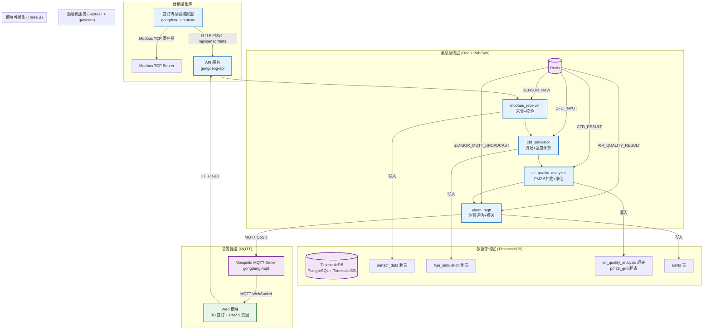

# 🏮 长信宫灯烟道流体仿真与室内空气质量分析系统

汉代长信宫灯复原研究全栈应用系统，集 **Modbus TCP 传感器模拟**、**烟道流体仿真（CFD）**、**PM2.5 扩散模型**、**三维可视化** 于一体。

---

## 📐 系统架构



### 模块职责

| 模块 | 职责 | 关键技术 |
|------|------|----------|
| **modbus_receiver** | 传感器数据采集与 7 项物理校验 | Modbus TCP, Pydantic |
| **cfd_simulator** | 烟道流场计算、温度分布、烟尘沉降 | Re/Gr/Nu 数, Sutherland 粘度, 欧拉积分 |
| **air_quality_analyzer** | PM2.5 三维扩散、净化效果评估 | 7 点拉普拉斯, 一阶迎风格式, 球形净化 |
| **alarm_mqtt** | 三类告警双级别评估 + MQTT 推送 | paho-mqtt, 5 分钟冷却去重 |

### 8 通道流水线

```
SENSOR_RAW → CFD_INPUT → CFD_RESULT → AIR_QUALITY_INPUT → AIR_QUALITY_RESULT
                                                                  → ALERT_INPUT → ALERT_PUBLISHED
旁支：SENSOR_MQTT_BROADCAST (独立广播传感器原始数据)
```

---

## 📁 项目结构

```
AI_solo_coder_task_A_133/
├── backend/
│   ├── main.py                    # FastAPI 入口 (gunicorn + uvicorn)
│   ├── gunicorn.conf.py           # Gunicorn 生产配置
│   ├── app/
│   │   ├── config.py              # 环境变量配置
│   │   ├── config_loader.py       # JSON 配置加载器
│   │   ├── database.py            # SQLAlchemy 异步连接
│   │   ├── bus/                   # Redis Pub/Sub 事件总线
│   │   │   ├── channels.py        # 8 通道定义
│   │   │   └── redis_bus.py       # 总线实现 (in-memory 回退)
│   │   ├── modules/               # 4 个微服务模块
│   │   │   ├── modbus_receiver.py
│   │   │   ├── cfd_simulator.py
│   │   │   ├── air_quality_analyzer.py
│   │   │   └── alarm_mqtt.py
│   │   ├── routers/
│   │   │   └── sensor.py          # REST API 路由
│   │   ├── models/                # SQLAlchemy 模型
│   │   ├── schemas/               # Pydantic Schema
│   │   └── services/              # v1 旧版（兼容参考）
│   └── Dockerfile                 # 多阶段构建
│
├── simulator/
│   ├── gongdeng_simulator.py      # Modbus TCP 传感器模拟器
│   └── Dockerfile.simulator
│
├── config/                        # 外置 JSON 配置
│   ├── fuel_types.json            # 5 种燃料物性
│   ├── cfd_parameters.json        # 流体仿真参数
│   └── air_quality_parameters.json # 空气质量参数
│
├── database/
│   ├── init.sql                   # 表结构 + 超表创建
│   └── timescale_policy.sql       # 降采样 + 保留策略
│
├── mosquitto/
│   └── mosquitto.conf             # MQTT Broker 配置
│
├── frontend/
│   ├── index.html                 # 主页面
│   ├── gong_deng_3d.js            # Three.js 3D 渲染
│   └── air_quality_panel.js       # UI 控制面板 + API 轮询
│
├── docker-compose.yml             # 5 服务编排
├── .env.example                   # 环境变量模板
├── .dockerignore
├── requirements.txt
└── README.md
```

---

## 🚀 快速部署（Docker Compose）

### 前置要求
- Docker 24.0+
- Docker Compose v2+
- 至少 4GB 可用内存

### 部署步骤

```bash
# 1. 克隆仓库
git clone <repo-url>
cd AI_solo_coder_task_A_133

# 2. 配置环境变量
cp .env.example .env
# 编辑 .env，修改密码等敏感配置

# 3. 启动全部服务
docker compose up -d

# 4. 查看服务状态
docker compose ps

# 5. 查看日志
docker compose logs -f api          # 后端 API
docker compose logs -f simulator    # 模拟器
docker compose logs -f timescaledb  # 数据库
```

### 访问地址

| 服务 | 地址 | 说明 |
|------|------|------|
| **前端可视化** | http://localhost:8000 | 宫灯 3D 模型 + PM2.5 云图 |
| **API 文档** | http://localhost:8000/docs | Swagger UI |
| **健康检查** | http://localhost:8000/health | 返回架构信息 |
| **MQTT** | tcp://localhost:1883 | 告警订阅 |
| **MQTT WebSocket** | ws://localhost:9001 | 前端直接连接 |
| **Redis** | localhost:6379 | 消息总线 |
| **TimescaleDB** | localhost:5432 | 时序数据库 |
| **Modbus TCP** | localhost:502 | 传感器寄存器 |

### 常用操作

```bash
# 停止服务
docker compose stop

# 重启服务
docker compose restart

# 升级镜像并重启
docker compose pull && docker compose up -d

# 查看数据库策略
docker compose exec timescaledb psql -U postgres -d changxin_gongdeng \
    -c "SELECT * FROM gongdeng_policies;"

# 订阅 MQTT 告警
docker compose exec mqtt mosquitto_sub -t gongdeng/alerts -v

# 修改模拟器燃料类型（不重启）
docker compose run --rm simulator \
    --fuel-type beeswax \
    --air-change-rate 2.5 \
    --no-anomalies
```

---

## 🧪 宫灯传感器模拟器使用

模拟器支持 **环境变量** 和 **CLI 参数** 两种配置方式，可动态调整实验条件。

### 可配置参数

| 参数 | 环境变量 | CLI | 说明 |
|------|----------|-----|------|
| **燃料类型** | `FUEL_TYPE` | `--fuel-type` | animal_fat / sesame_oil / beeswax / mineral_oil / tallow |
| **通风换气率** | `AIR_CHANGE_RATE` | `--air-change-rate` | 0-20 ACH（次/小时） |
| **室外 PM2.5** | `OUTDOOR_PM25` | `--outdoor-pm25` | 0-500 μg/m³ |
| **火焰强度** | - | `--flame-intensity` | 0.1-1.0 |
| **异常注入** | `INJECT_ANOMALIES` | `--no-anomalies` | 烟道堵塞 / 火焰波动 |
| **上报间隔** | `REPORT_INTERVAL` | `--report-interval` | 秒 |
| **Modbus** | `ENABLE_MODBUS` | `--no-modbus` | 开关 |
| **HTTP 上报** | `ENABLE_HTTP` | `--no-http` | 开关 |

### 燃料种类说明

| 类型 | 中文名 | 热值 (MJ/kg) | 温度因子 | Modbus 寄存器值 |
|------|--------|-------------|----------|----------------|
| `animal_fat` | 动物脂肪 | 37.5 | ×1.00 | 1 |
| `sesame_oil` | 麻油 | 39.3 | ×1.03 | 2 |
| `beeswax` | 蜜蜡 | 40.6 | ×1.05 | 3 |
| `mineral_oil` | 矿物油 | 44.0 | ×1.12 | 4 |
| `tallow` | 牛油 | 39.0 | ×1.02 | 5 |

### 对比实验示例

```bash
# 实验 1: 动物脂肪，通风差
docker compose run --rm simulator \
    --fuel-type animal_fat \
    --air-change-rate 0.5 \
    --no-anomalies

# 实验 2: 矿物油，通风好
docker compose run --rm simulator \
    --fuel-type mineral_oil \
    --air-change-rate 4.0 \
    --no-anomalies

# 实验 3: 蜜蜡，含随机异常
docker compose run --rm simulator \
    --fuel-type beeswax \
    --air-change-rate 1.0 \
    --report-interval 30
```

### 直接运行（不用 Docker）

```bash
cd simulator

# 使用蜜蜡，2.5 ACH 通风，30秒上报
python gongdeng_simulator.py \
    --fuel-type beeswax \
    --air-change-rate 2.5 \
    --report-interval 30

# 仅测试，不启用 Modbus
python gongdeng_simulator.py \
    --no-modbus \
    --fuel-type sesame_oil
```

---

## 📊 TimescaleDB 降采样与保留策略

### 数据保留策略

| 数据 | 粒度 | 保留时长 |
|------|------|----------|
| 原始传感器数据 | 秒级 | 30 天 |
| PM2.5 三维网格 | 5×5×5 | 7 天 |
| 1 分钟聚合 | 1 min | 90 天 |
| 1 小时聚合 | 1 hour | 1 年 |
| 1 天聚合 | 1 day | 永久 |
| 告警记录 | - | 1 年 |

### 连续聚合视图

```sql
-- 实时 1 分钟聚合（每 1 分钟刷新）
SELECT * FROM sensor_data_1min ORDER BY bucket DESC LIMIT 10;

-- 1 小时聚合
SELECT * FROM sensor_data_1hour ORDER BY bucket DESC LIMIT 10;

-- 1 天聚合
SELECT * FROM sensor_data_1day ORDER BY bucket DESC LIMIT 10;
```

### 压缩策略

- **7 天以上数据**：自动按列压缩（segment by `lamp_id`）
- 存储节省约 **80-90%**
- 查询透明，无需修改 SQL

### 查看所有策略

```sql
SELECT * FROM gongdeng_policies;
```

---

## 🔌 API 接口

| 方法 | 路径 | 说明 |
|------|------|------|
| `POST` | `/api/sensor/data` | 上报传感器数据（触发完整管线） |
| `GET` | `/api/sensor/data/latest` | 获取最新综合数据 |
| `GET` | `/api/sensor/data/history` | 获取传感器历史数据 |
| `GET` | `/api/simulation/flue/latest` | 获取最新烟道仿真结果 |
| `GET` | `/api/simulation/air-quality/latest` | 获取最新空气质量分析 |
| `GET` | `/api/simulation/pm25-grid/latest` | 获取 PM2.5 三维网格 |
| `GET` | `/api/simulation/particles` | 获取烟气粒子轨迹 |
| `GET` | `/api/simulation/fuel-types` | 获取可用燃料类型列表 |
| `GET` | `/api/alerts/active` | 获取活跃告警 |
| `GET` | `/api/alerts/history` | 获取告警历史 |
| `GET` | `/api/statistics` | 获取统计数据 |
| `GET` | `/health` | 健康检查 |

### 传感器数据上报示例

```bash
curl -X POST http://localhost:8000/api/sensor/data \
  -H "Content-Type: application/json" \
  -d '{
    "lamp_id": 1,
    "oil_consumption": 2.1,
    "flue_temperature": 148.0,
    "flue_velocity": 0.52,
    "indoor_pm25": 72.0,
    "oil_level": 390,
    "ambient_temperature": 23.8,
    "ambient_humidity": 52.0,
    "fuel_type": "beeswax",
    "air_change_rate": 1.0,
    "outdoor_pm25": 28.0
  }'
```

---

## 🏗️ 生产环境优化

### Gunicorn + Uvicorn 配置

```python
# gunicorn.conf.py
workers = CPU_CORES * 2 + 1      # 进程数
worker_class = "uvicorn.workers.UvicornWorker"  # 异步 worker
worker_connections = 1000       # 最大并发连接
max_requests = 10000            # 自动重启防内存泄漏
timeout = 120
preload_app = True              # 预热加载，减少内存
```

### Gzip 压缩

- FastAPI `GZipMiddleware` 自动压缩 **> 500 字节** 的响应
- 压缩级别 6，兼顾速度与压缩率
- 前端静态资源（JS/CSS/HTML）自动压缩

### 高可用建议

```yaml
# docker-compose.override.yml 示例
services:
  api:
    deploy:
      replicas: 3
      resources:
        limits:
          cpus: '2'
          memory: 2G
  redis:
    command: redis-server --appendonly yes --sentinel-announce-ip ...
  timescaledb:
    volumes:
      - /mnt/nfs/timescaledb:/var/lib/postgresql/data
```

---

## 🧪 本地开发

```bash
# 1. 创建虚拟环境
python -m venv venv
source venv/bin/activate  # Windows: venv\Scripts\activate

# 2. 安装依赖
pip install -r requirements.txt

# 3. 运行验证套件
python scripts/run_verify.py

# 4. 启动服务（开发模式）
cd backend
python main.py

# 5. 启动模拟器（新终端）
cd simulator
python gongdeng_simulator.py --no-modbus --fuel-type beeswax
```

---

## 📝 许可证

本项目用于工艺史学术研究用途。
